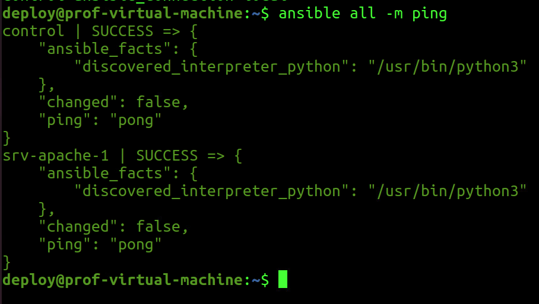
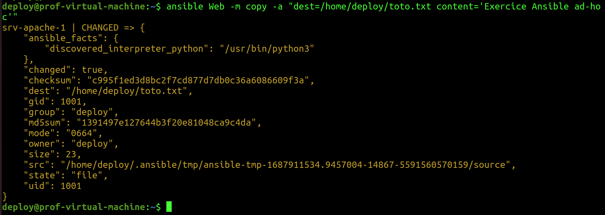
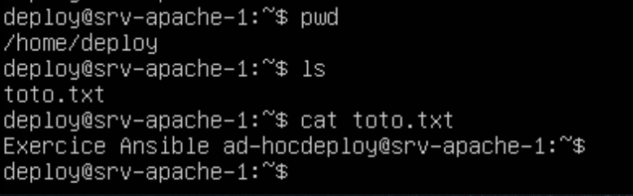
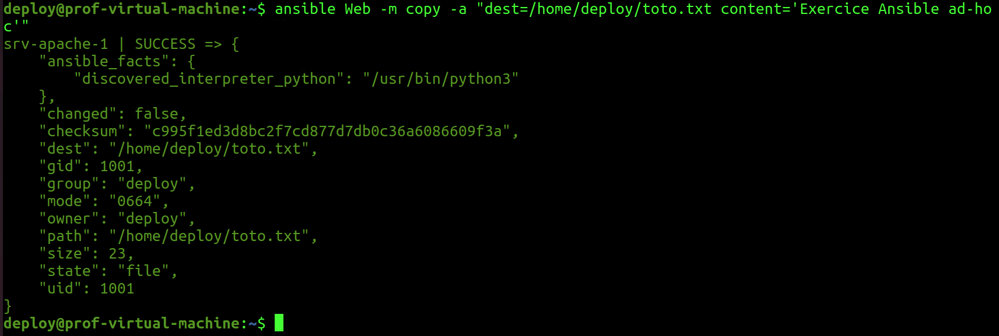
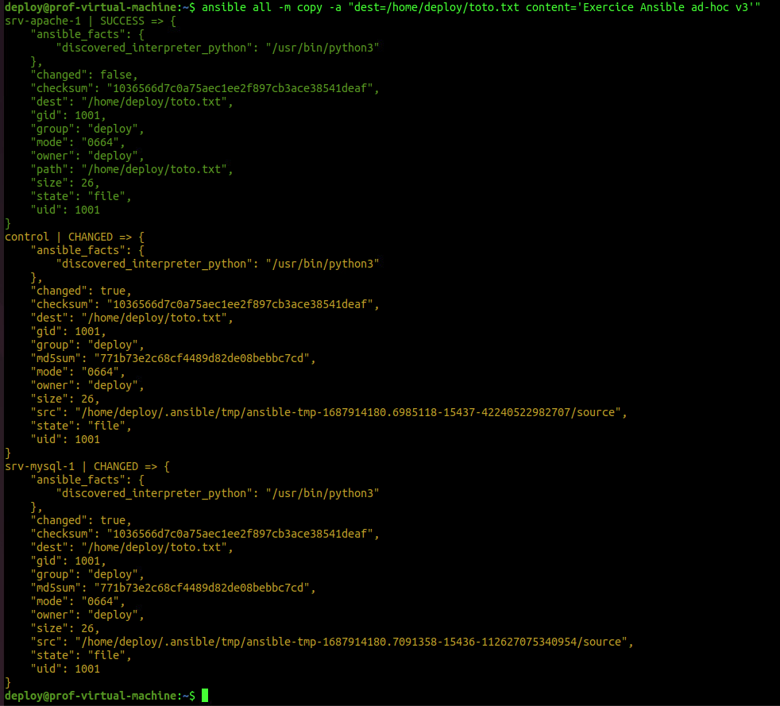

# Exercice 18 - Ansible  - Mode ad hoc  

## Informations  
- Durée estimée : 3 heures.  
- Système d'exploitation : Linux.  
- Environnement : Virtuel.   

## Objectifs  

- Déterminer les différents types de tests à effectuer.  
- Appliquer la séquence d’exécution des tests selon le service visé.  
- Déterminer la pertinence des correctifs proposés.  
- Gérer les correctifs de logiciels, du système d’exploitation et des micrologiciels (Firmware).  
- Appliquer les correctifs.  
- Déterminer les indices de performance des serveurs.  
- Paramétrer les indices de performance.  
- Mettre en place des mécanismes d’agrégation des serveurs.  
- Gérer le stockage.  

## Description  

Dans cet exercice, nous allons utiliser Ansible sur des machines distantes en mode ad hoc.    
Le mode ad hoc est en général utilisé dans ces situations :  

- Test de module.  
- Lancement de tâche rapidement.  

Voici les tâches à réaliser dans cet exercice :  

  - Modifier le fichier d'inventaire.   
  - Utilisez une commande ad hoc pour tenter de rejoindre le/les clients Ansible.  
  - Utilisez une commande ad hoc pour créer un fichier toto.txt avec le contenu "Exercice Ansible ad hoc" qui se trouvera sur les clients, et ce, dans le dossier /home/deploy/toto.txt.  
  - Vérifier que le fichier a bien été créé avec le contenu.  
  - Rajoutez un client et modifiez le fichier inventaire afin de rajouter le nouveau client.  
  - Relancez l'action ping et de création de fichiers sur les clients.  
  - Vérifier le résultat.  
  - Testez l'effet du module "setup" sur votre inventaire.  


## Section 1 : Un hôte  

### Sur votre machine de contrôle  

Modifier le fichier d'inventaire pour ne plus avoir d'erreurs sur localhost.   

```bash
su -l deploy
pwd
ansible --version
vim hosts # ou l'éditeur de votre choix.
```  

Contenu du fichier inventaire :  

```ini
[Web]
srv-apache-1 ansible_host=X.X.X.X # IP de votre hôte

[local]
control ansible_connection=local

```  

Vérifier le contenu du fichier.  

```bash
cat hosts
```  

Maintenant, nous pouvons faire les commandes ad hoc :  

```bash
# Syntaxe :
# ansible -i[ fichier hosts] -m [module] [groupe de machine dans le fichier d'inventaire] 
ansible -m ping all
```  

**Attention** : comme le fichier inventaire est défini dans le fichier <code>ansible.cfg</code> du répertoire de travail, le paramètre <code>-i</code> n'est pas nécessaire.  

Sortie :  

  
**Figure 1 : module ping.**  

Maintenant, utilisons le module [copy](https://docs.ansible.com/ansible/latest/collections/ansible/builtin/copy_module.html). On va créer le fichier sur ```srv-apache-1``` avec un contenu. Mais, seulement sur la machine ```srv-apache-1``` qui est dans le groupe Web :  

```bash
ansible -m copy -a "dest=/home/deploy/toto.txt content='Exercice Ansible ad hoc'" Web
```

Sortie :  

  
**Figure 2 : module copy.**  

### Vérification sur la machine srv-apache-1  

```bash
ssh deploy@adresseIP_srv-apache-1
ls -ahl
cat toto.txt
exit
```  

  
**Figure 3 : vérification de la commande copy.**  

### Sur votre machine de contrôle  

Exécutez à nouveau la commande :  

```bash
ansible -m copy -a "dest=/home/deploy/toto.txt content='Exercice Ansible ad hoc'" Web
```  


**Figure 4 : reprise de la commande copy.**  

**Attention :** remarquez les changements (ou non-changement) au niveau ```"changed: false"```, il indique false.

Si nous avions fait une copie avec ```scp```, quelle aurait été la situation ?  

Vous pouvez le tester :  

```bash
vim toto.txt # Ajoutez le contenu 'Exercice Ansible ad hoc'
scp toto.txt deploy@x.x.x.x:/home/deploy/toto.txt #Remplacer x.x.x.x par l'adresse IP de votre serveur
```  

Le fichier va écraser l'autre. Ansible lui voit que c'est le même contenu donc ne fait rien.  

Essayer à nouveau avec une modification au contenu :  

```bash
ansible -m copy -a "dest=/home/deploy/toto.txt content='Exercice Ansible ad hoc v2'" Web
```  

Ansible a modifié le fichier.  

À nouveau avec la même commande :

```bash
ansible Web -m copy -a "dest=/home/deploy/toto.txt content='Exercice Ansible ad hoc v2'"
```  

Rien n'a changé (```changed:false```)  
Essayer à nouveau avec ceci :  

```bash
ansible Web -m copy -a "dest=/home/deploy/toto.txt content='Exercice Ansible ad hoc v3'"
```  

Le fichier a changé (```changed:true```)

Il exécute le changement seulement s’il y a changement à faire au fichier. Alors que ```scp``` va nécessairement écraser le fichier à chaque fois.  

### Il s'agit ici de la notion d'**idempotence** :  

Un logiciel idempotent produit le même résultat souhaitable chaque fois qu'il est exécuté.  
Dans un logiciel de déploiement, l'idempotence permet la convergence et la composabilité, ce qui permet de :  

- Rassembler plus facilement des composants dans des collections qui créent de nouveaux types d'infrastructure et effectuent de nouvelles tâches opérationnelles.  
- Exécuter des collections complètes de développement/déploiement pour réparer en toute sécurité les petits problèmes d'infrastructure, effectuer des mises à niveau progressives, modifier la configuration ou gérer la mise à l'échelle.  

## Section 2 : Ajouter un nouveau serveur  

Utiliser le même gabarit utilisé pour créer une seconde machine :  

- Allez dans le dossier : ```DFC DS -> VM DFC -> Modeles -> ClaudeRoy -> TPL_20250514_UbSrv2404_Base```
- Sélectionnez le modèle de VM et cliquez sur le bouton droit de votre souris et sélectionnez <code>Nouvelle VM à partir de ce modèle...</code>  
- Suivez les étapes  
    - Nom de la VM : ```srv-mysql-[matricule]```  
    - Emplacement : ```DFC DS -> VM DFC -> H26_4375_420-W45-SF_ISS_EGCR```  
    - Stockage : ESXDFC3  
- L’utilisateur / mot de passe est toujours : etudiant / S0l&il01.    
 
- Après votre connexion, changer les informations suivantes : 

    - Nom de la machine (<code>sudo hostnamectl set-hostname srv-mysql-1</code>) : srv-mysql-1.  
    - Créer un utilisateur **deploy** avec le même mot de passe que sur votre machine de contrôle.  
     - Membre des groupes **sudo** et **adm**.  


```bash
 sudo adduser deploy 
 sudo usermod -aG adm,sudo deploy
 su -l deploy # se connecter avec deploy
```  

- Pour éviter les problèmes de doublon d'adresse IP, je vous recommande de faire les commandes suivantes (vous aurez besoin de refaire ces commandes à chaque lancement de la VM) :  

```bash
sudo apt install isc-dhcp-client -y
sudo ip add flush ens33
sudo dhclient -v ens33
ip -4 add
```

### Machine de contrôle 

- Copier la clé ssh de deploy de la machine de contrôle sur la machine ```srv-mysql-[matricule]```.    

- Ajouter la machine à l'inventaire :  

```bash
vim hosts

#contenu du fichier hosts :
[Mysql]
srv-mysql-1 ansible_host=X.X.X.X # IP de votre hôte

[Web]
srv-apache-1 ansible_host=X.X.X.X # IP de votre hôte

[local]
control ansible_connection=local

```  

Vérifiez la connectivité.  

```bash
ansible all -m ping
```  

Refaites la copie  

```bash
ansible -m copy -a "dest=/home/deploy/toto.txt content='Exercice Ansible ad hoc v3'" all
```  

**Attention  :**  

- Ansible fait le travail sur localhost avec changed=true.  
- Ansible fait le travail sur srv-apache avec changed=false.  
- Ansible fait aussi le travail sur le srv-mysql avec change=true.  

Voici la sortie :  

  
**Figure 5 : module copy sur toutes les machines.**  

## Section 3 : Ansible - Mode ad hoc avec format YAML  

Dans cette partie de l'exercice, nous allons utiliser Ansible sur des machines distantes en mode ad hoc mais cette fois, avec un inventaire au format YAML.  
 
### Sur votre machine de contrôle  

À l'aide d'un éditeur de texte, reproduire le fichier d'inventaire en format YAML.  
Consultez la documentation pour vous aider : [documentation](https://docs.ansible.com/ansible/latest/user_guide/intro_inventory.html).  

Vérifiez vos informations :  

```bash
cat hosts.yaml
```  

<details>
  <summary markdown="span">Réponse.</summary>
  
```yaml
# hosts.yaml
---
Web:
  hosts:
    srv-apache-1:
      ansible_host: 10.100.2.128
Mysql:
  hosts:
    srv-mysql-1:
      ansible_host: 10.100.2.206
local:
  hosts:
    control:
      ansible_connection: local
```  

</details>  

Maintenant, nous pouvons faire les commandes ad hoc:  

```bash
ansible -i hosts.yaml -m ping all
```  

## Section 4 : Le module setup

Le module ```setup``` balai la machine pour vous donner l'ensemble des informations à exploiter dans les playbook que nous utiliserons dans le prochain exercice.  

Faites la commande :  

```bash
ansible -i hosts.yaml -m setup all
```  

Comme la sortie est trop imposante, renvoyez-le tous dans un fichier :  

```bash
ansible -i hosts.yaml -m setup all > setup.txt
```  
Remarquer les points suivants pour chacune des machines :  

 - Adresse IPv4 et IPv6.  
 - Nos distributions : ansible_ditribution.  
 - Les variables d'environnement : ansible_env.  
 - Plusieurs informations sur les éléments physiques de la machine :  
    - Disque dur  
    - Mémoire vive   
    - etc.  

## Référence :  

[Documentation officielle d'Ansible](https://docs.ansible.com/ansible/latest/getting_started/index.html)  
[group discussion](https://groups.google.com/g/ansible-project)  
[Choisir l'interpréteur Python](https://docs.ansible.com/ansible/latest/reference_appendices/python_3_support.html)  
